## **Documentation for Project 17**

### Automate Infrastructure With IAC using Terraform Part 2

### Creating Private Subnets using the count function and incrementing the count.index value for the cidr block function of our private subnet by 2 so that our subnets will not overlap thereby causing our application to malfunction

### Terraform plan showing the private subnets that will be created such that it will not overlap with the public subnet

### Tagging our Subnets appropriately using the tag = merge function

### Declaring tag variables

### Declaring tag values

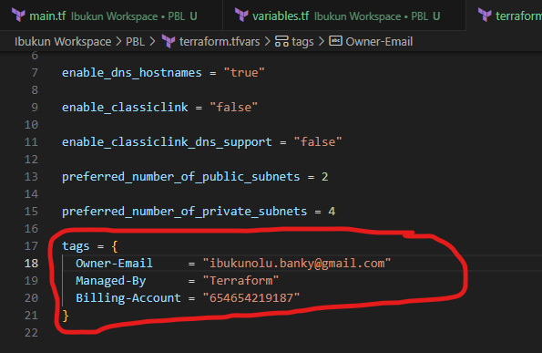

### Terraform Plan to show our Tags attached to our subnets respectively

### Creating Internet Gateway and NAT Gateway with Elastic IP

### Creating Internet Gateway in a separate TF file

### Creating NAT Gateway in a separate TF file

### Elastic IP created alongside our NAT Gateway in the same TF File

### Terraform Plan to show updated resources about to be created

### Terraform graph to show dependencies

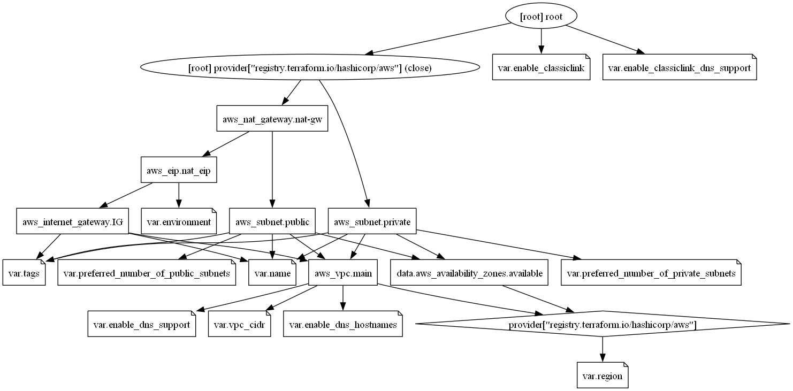

### Creating AWS Routes and subnet associations

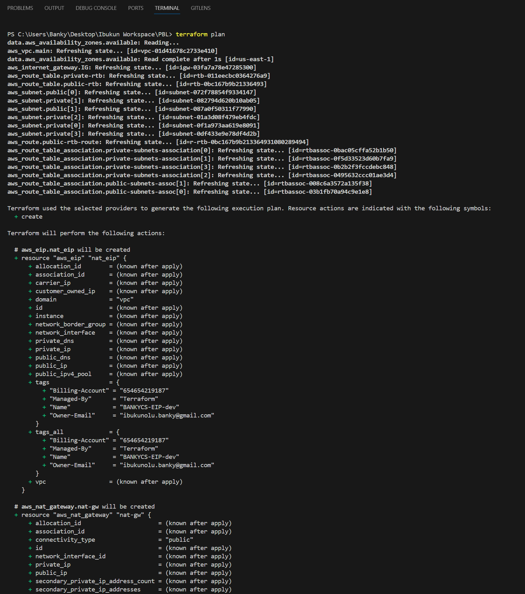

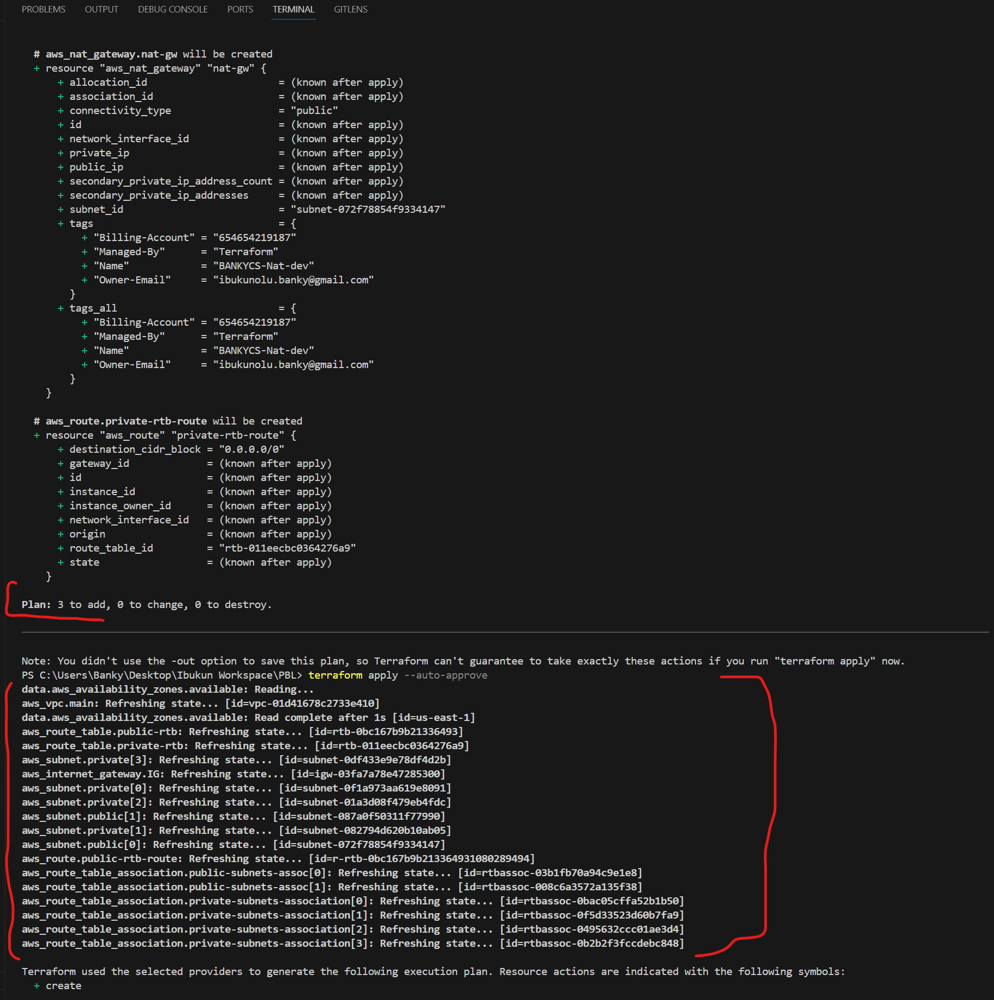

### Creating a Certificate for our load Balancers

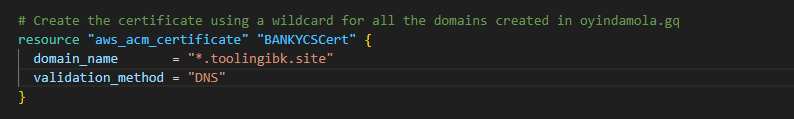
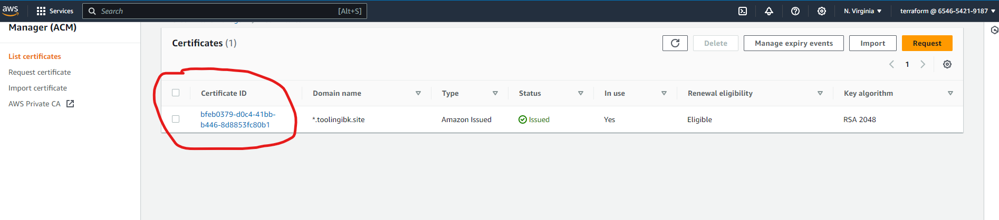

### Creating Security Groups

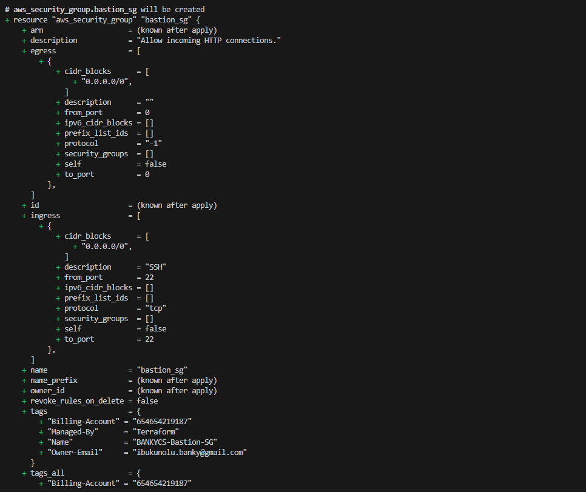
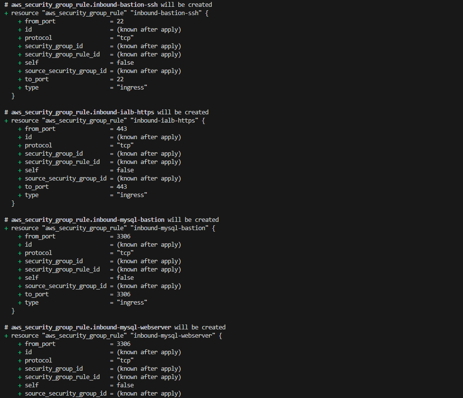

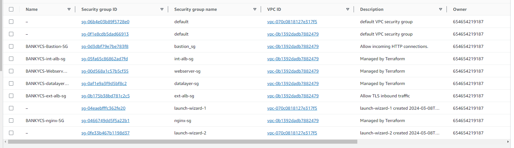

### Creating record in our route53 hosted zone

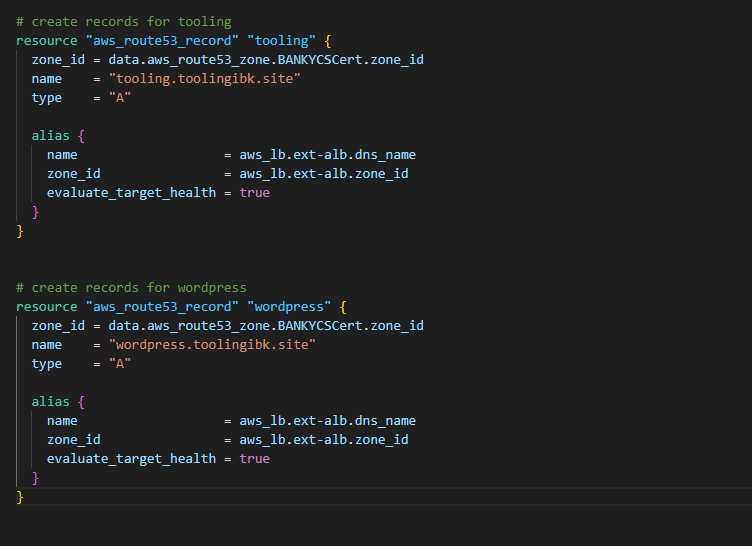

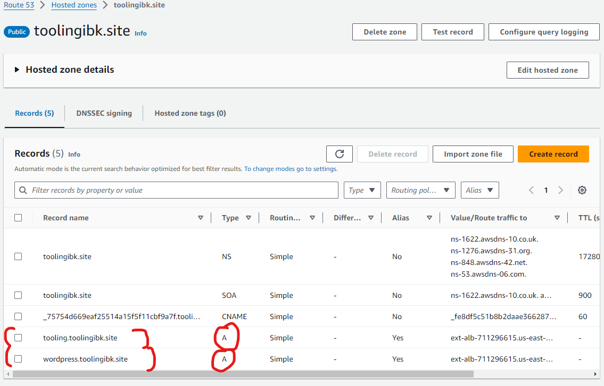

### Creating Load Balancers

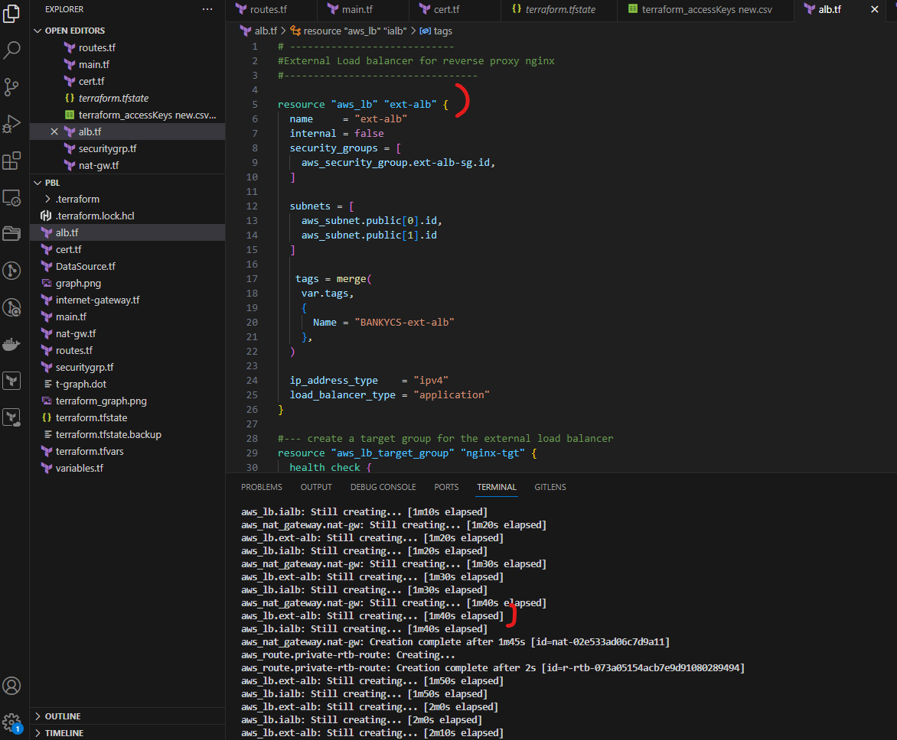
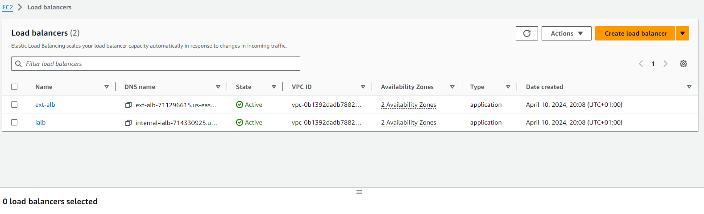

### Creating Target Groups

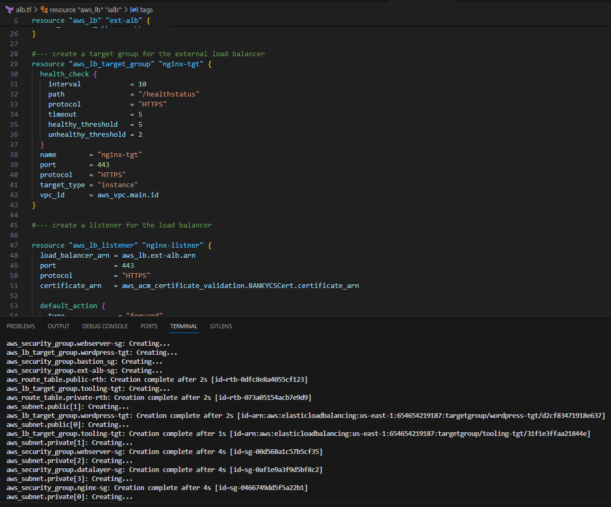

### Creating Load Balancer Listener Rule

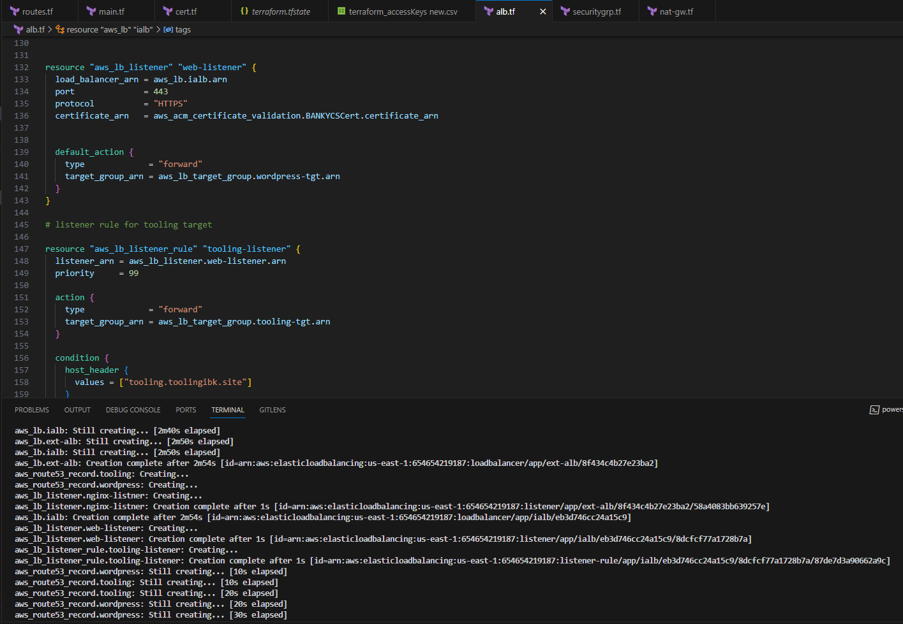
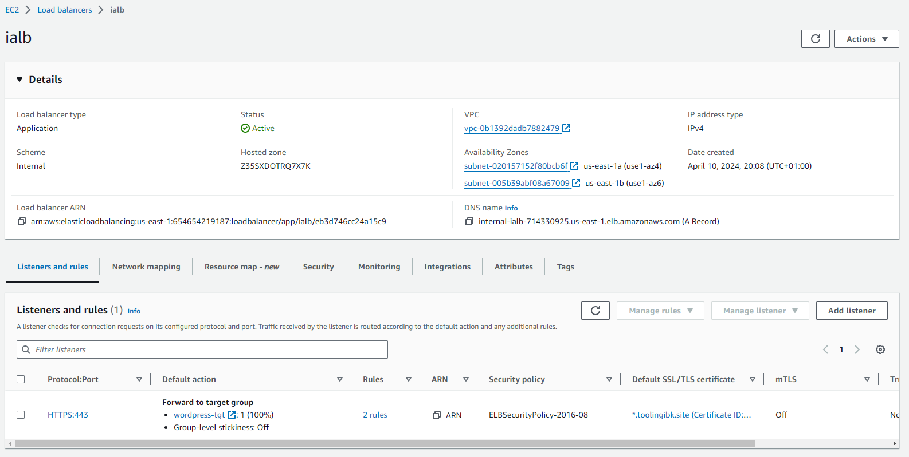

